# Tafoo
Tafoo, ikinci el araç alım satım işlemlerinde yanlış bilginin önüne geçmek amacıyla görüntü işleme teknikleri kullanılarak hasarın ve hasar bölgesinin tespiti yapılmasını hedeflemektedir. Buna ek olarak, uygulama içindeki chatbot sayesinde kullanıcıların araç alım sürecinde akıllarındaki sorulara cevaplar verilerek yanlış bilgiye maruz kalmalarının önlenmesi amaçlanmıştır.

### 🛠 Kullanılan Teknolojiler

- Mobil Uygulama Geliştirme: Flutter (https://flutter.dev/)
- Yapay Zeka Chatbot API Sistemi: OpenRouter (https://openrouter.ai/)
- Veri Tabanı: Firebase Firestore (https://firebase.google.com/docs/firestore)
- Yapay Zeka Modelleri: Detectron, Mask R-CNN, Torch.
- Arayüz ve model entegresi: Flask
- UI/UX tasarımı : Figma

Görseller:

 

  

    <h3>Splash & Giriş ekranı & Anasayfa</h3>
    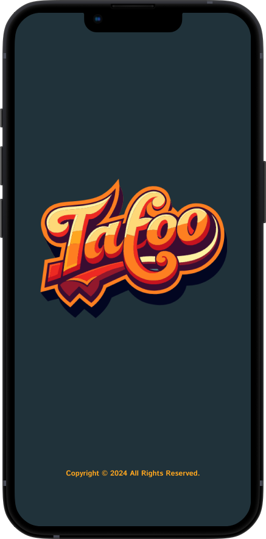
    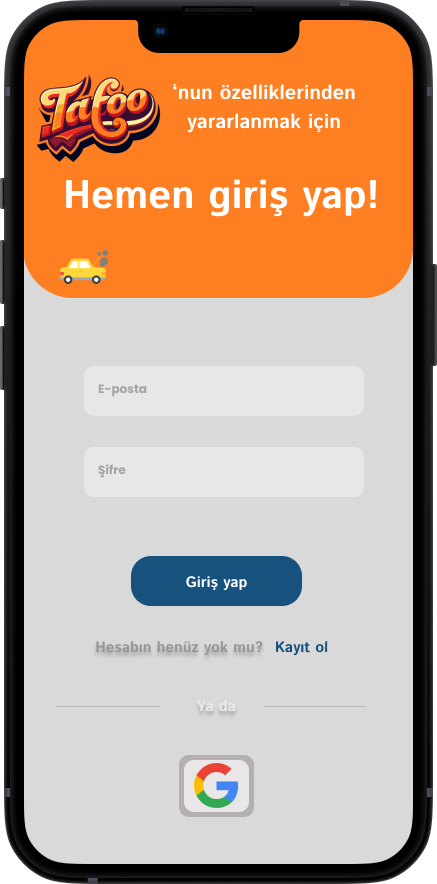
    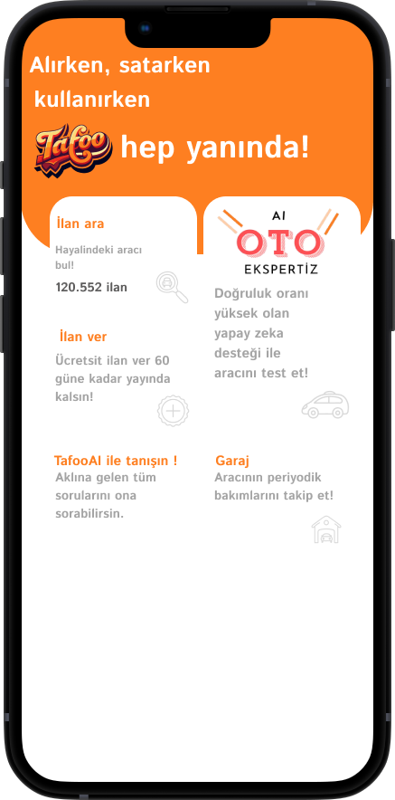
  

  

    <h3>İlan Arama Kısımları</h3>
    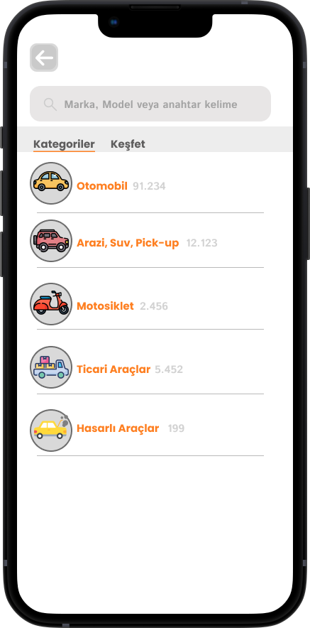
    
  

  

    <h3>İlan Verme ve Sonuçları Görme</h3>
    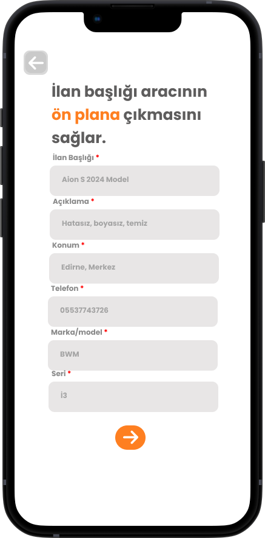
    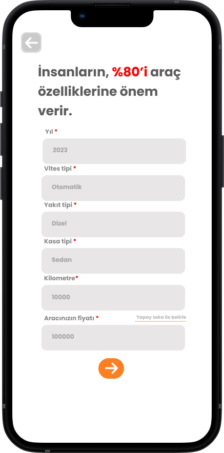
    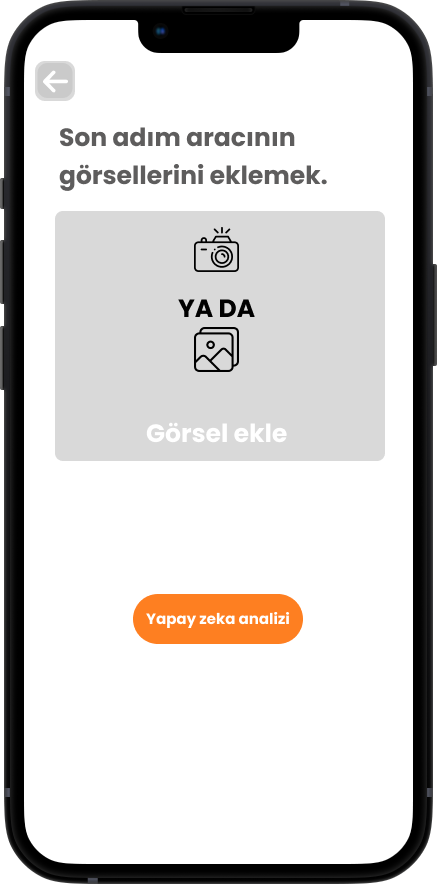
    
    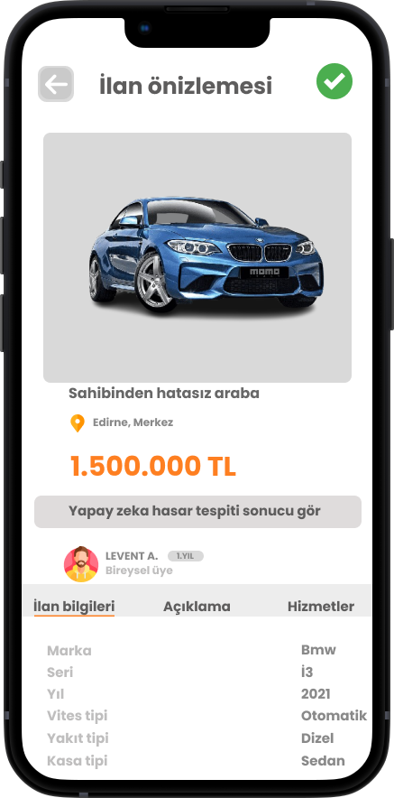
    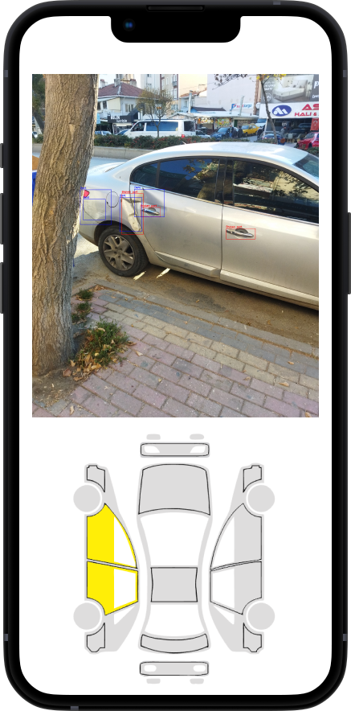
  

  

    <h3>Chatbot</h3>
    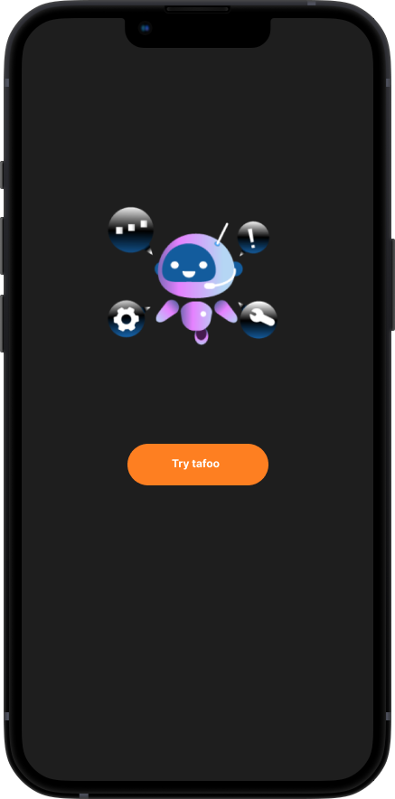
    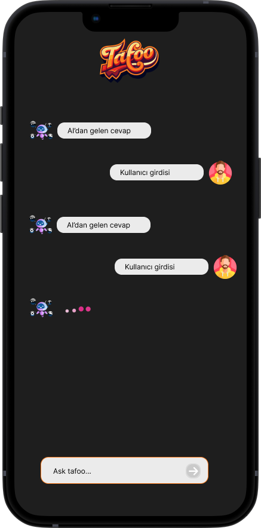
  

