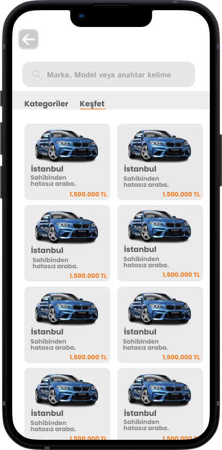

# Tafoo
Tafoo, ikinci el araç alım satım işlemlerinde yanlış bilginin önüne geçmek amacıyla görüntü işleme teknikleri kullanılarak hasarın ve hasar bölgesinin tespiti yapılmasını hedeflemektedir. Buna ek olarak, uygulama içindeki chatbot sayesinde kullanıcıların araç alım sürecinde akıllarındaki sorulara cevaplar verilerek yanlış bilgiye maruz kalmalarının önlenmesi amaçlanmıştır.

### 🛠 Kullanılan Teknolojiler

- Mobil Uygulama Geliştirme: Flutter (https://flutter.dev/)
- Yapay Zeka Chatbot API Sistemi: OpenRouter (https://openrouter.ai/)
- Veri Tabanı: Firebase Firestore (https://firebase.google.com/docs/firestore)
- Yapay Zeka Modelleri: Detectron, Mask R-CNN, Torch.
- Arayüz ve model entegresi: Flask
- UI/UX tasarımı : Figma

Görseller:

 

  

    <h3 style="color: white; margin-bottom: 10px;">Splash & Giriş ekranı & Anasayfa</h3>
    
    
    
  

  

    <h3 style="color: white; margin-bottom: 10px;">İlan Arama Kısımları</h3>
    
    
  

  

    <h3 style="color: white; margin-bottom: 10px;">İlan Verme ve Sonuçları Görme</h3>
    
    
    
    
    
    
  

  

    <h3 style="color: white; margin-bottom: 10px;">Chatbot</h3>
    
    
  

Tafoo, ikinci el araç alım satım işlemlerinde kullanıcılara basit arayüzü ve hızlı çalışma yapısıyla destek olmaktadır. Bununla birlikte kullanıcıların bilgilere doğru ve hızlı şekilde ulaşması amaçlanarak tasarım ve modelleme kısımları bu şartlara uygun şekilde değerlendirilmiştir.

Proje kapsamında sonuçlar incelenerek R50-FPN ve R101-FPN methodlarının arasından yüksek değerleri olan tercih edilerek uygulamaya entegre edilmiştir. Uygulama içerisinde de hem ilan verme aşamasında hem de kolay kullanım sunması açısından direkt erişim olarak anasayfaya eklenmiştir. Böylece ikinci el araç ilanlarında hasar tespiti ve bölge tespiti yapılarak kullanıcıyı doğru bilgiye ulaştırma amaçlanmıştır.

İlerleyen aşamalarda daha iyi bir veri seti ile daha doğru değerlere sahip modeller eğitilebilir. Böylelikle uygulamanın amacı daha da pekiştirilmiş olacaktır. Proje kapsamı geliştirilerek tespit edilen hasarın maliyet ve onarım fiyatı belirlemesi işlemi eklenebilir. 